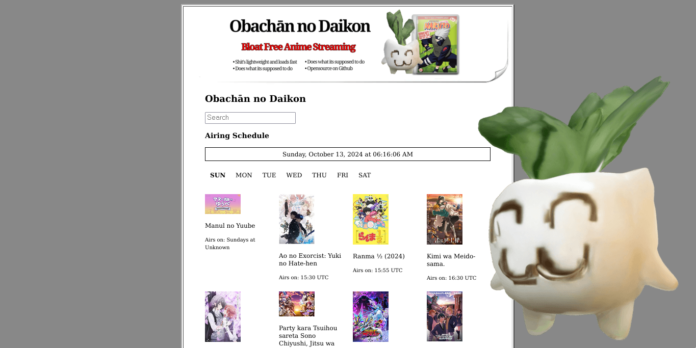

<h1 align="center">
  
<strong>Obachān no Daikon</strong>

  
</h1>

## **Daikon**

Daikon is an anime streaming site with a purposely outdated, basic interface. It's designed to provide an old-school viewing experience.

                           

## **Features**

List of current and upcoming features:

- [x] Anime schedule
- [x] Subbed only
- [x] Responsive
- [x] Keyboard shortcuts
- [ ] Anilist sync 
- [ ] Frame finder
- [ ] Custom API
 
